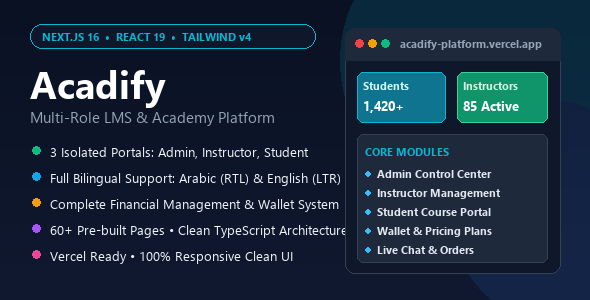
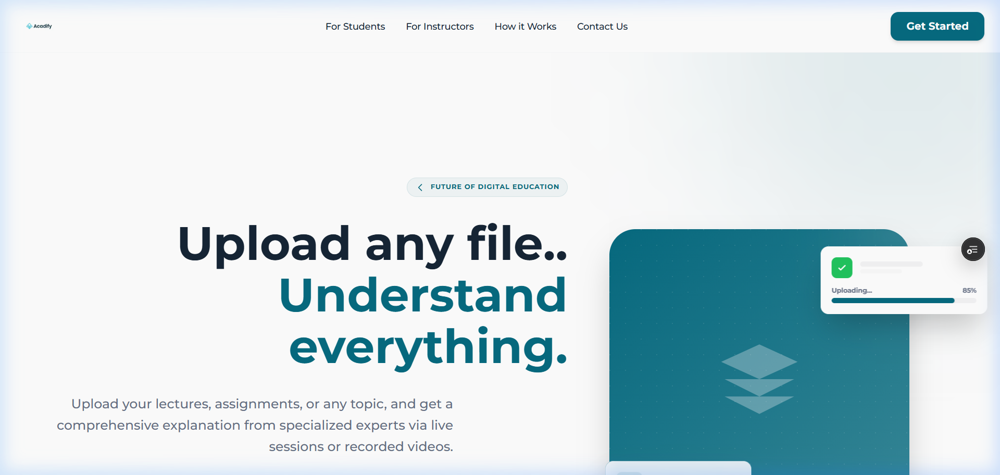
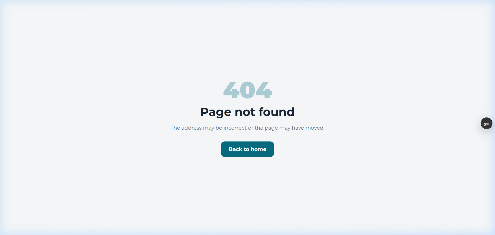
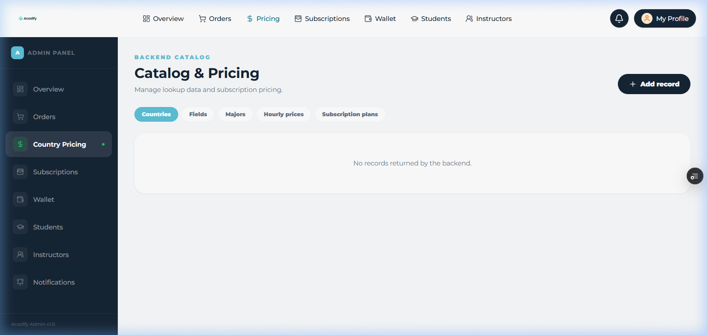
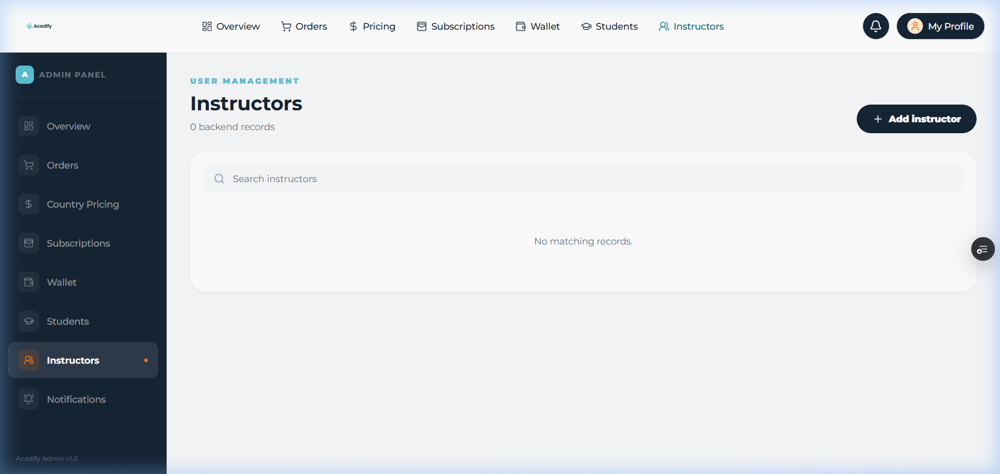
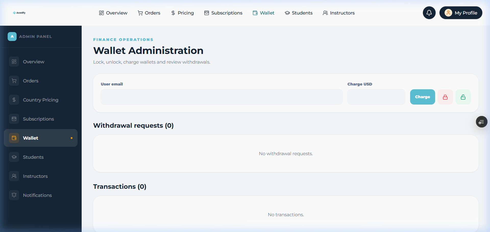
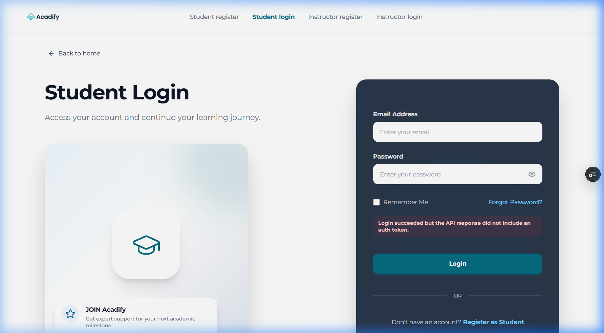

<div align="center">

# 🎓 Acadify
### Modern Multi-Role LMS & Academy Platform

**An enterprise-ready, production-grade Learning Management System built with Next.js 16, React 19, TypeScript, and Tailwind CSS v4.**  
Featuring native **Arabic (RTL) & English (LTR)** bilingual support with **3 isolated portals** for Admins, Instructors, and Students.

<br />

[](https://nextjs.org/)
[](https://react.dev/)
[](https://www.typescriptlang.org/)
[](https://tailwindcss.com/)
[](https://acadify-platform.vercel.app/)
[](https://acadify-platform.vercel.app/)

<br />

[🌐 **Explore Live Demo**](https://acadify-platform.vercel.app) • [🛡️ **Admin Panel Demo**](https://acadify-platform.vercel.app/admin/dashboard) • [👨‍🏫 **Instructor Portal**](https://acadify-platform.vercel.app/auth/instructor/login) • [🎓 **Student Portal**](https://acadify-platform.vercel.app/auth/student/login)

<br />



</div>

---

## 🌟 Executive Overview

**Acadify** is an all-in-one educational ecosystem designed to streamline academy management, course deliveries, tutor workflows, and student learning journeys. Crafted with the latest web standards (Next.js 16 App Router, React 19 Server Components, and Tailwind CSS v4), Acadify delivers blazing-fast page loads, effortless SEO prerendering, and fluid UX transitions.

It is natively localized with **full bidirectional support** (Arabic RTL & English LTR), making it the premier choice for regional and global educational institutions alike.

---

## 📸 Visual Showcase

<div align="center">

| 🚀 Modern Landing Page | 🛡️ Admin KPI Dashboard |
| :---: | :---: |
|  |  |

| 🏷️ Catalog & Multi-Tier Pricing | 👨‍🏫 Instructor Management |
| :---: | :---: |
|  |  |

| 💰 Financial Wallet & Payouts | 🎓 Student Dashboard Portal |
| :---: | :---: |
|  |  |

</div>

---

## 🚀 Key Modules & Architecture

### 🛡️ 1. Administrator Control Center
- **Overview Analytics:** Live counts for enrolled students, active instructors, pending requests, and financial transaction totals.
- **Dynamic Catalog & Pricing Engine:** Configure country-specific currencies, academic fields, majors, hourly session rates, and subscription bundles.
- **User Directory:** Filter, search, and manage verified student and instructor accounts.
- **Workflow & Orders Management:** Review tutorial orders, assignment deliverables, and status updates.
- **Financial Wallet Control:** Account balance locking/unlocking, manual credit charging, and tutor withdrawal approvals.

### 👨‍🏫 2. Instructor Workbench
- Dedicated teaching dashboard with task tracking and upcoming schedule.
- Manage one-on-one sessions, trial lesson offerings, and subject bids.
- Review submitted student homework and assignments with direct feedback.
- Personal earnings tracking, balance overview, and automated withdrawal requests.

### 🎓 3. Student Learning Portal
- Course discovery, enrollment, and personalized learning dashboard.
- Interactive assignment submission with real-time progress indicators.
- Live order chat interface for direct communication with assigned instructors.
- Personal wallet balance, credit top-ups, and subscription tier management.

---

## 🌐 Bilingual & RTL Engineering

- **Built with `next-intl`:** Clean locale routing (`/ar` and `/en`) with zero layout flicker.
- **Bidirectional Layouts:** Flexbox and CSS Grid alignments, chevron indicators, and form layouts automatically flip when switching between Arabic (Right-to-Left) and English (Left-to-Right).
- **Centralized Dictionary:** Fully translated JSON strings inside `messages/ar.json` and `messages/en.json` for rapid customization.

---

## 🛠️ Technology Stack

| Layer | Technology | Description |
| :--- | :--- | :--- |
| **Framework** | **Next.js 16.2 (App Router)** | Hybrid rendering, Turbopack builds, Server Actions & Server Components |
| **UI Library** | **React 19.2** | Concurrent mode, optimistic UI updates, zero unnecessary re-renders |
| **Styling** | **Tailwind CSS v4** | Modern CSS variables, lightning-fast compiler, zero configuration overhead |
| **Type Safety** | **TypeScript 5.x** | Strict typing across API contracts, props, and session models |
| **Localization** | **next-intl** | First-class internationalization with native RTL direction control |
| **Icons** | **Lucide React** | Clean, minimalist SVG iconography |
| **Testing** | **Playwright & Node Test Runner** | E2E frontend audits, accessibility testing, and unit tests |

---

## 📁 Repository Structure

```plaintext
acadify/
├── app/
│   ├── [locale]/             # Localized routes (Arabic & English)
│   │   ├── (admin)/admin/    # Admin portal (Overview, Pricing, Users, Wallet)
│   │   ├── (instructor)/     # Instructor workspace & task management
│   │   ├── (student)/        # Student learning dashboard & assignments
│   │   ├── (guest)/          # Marketing pages (Landing, About, Contact, Help)
│   │   └── auth/             # Multi-role authentication & registration flows
│   └── components/           # Reusable UI primitives (Buttons, Modals, Cards, Navbars)
├── lib/
│   ├── api/                  # Typed REST API client & error handling
│   └── auth/                 # Session management, cookies & demo bypass logic
├── messages/
│   ├── ar.json               # Arabic translations (RTL)
│   └── en.json               # English translations (LTR)
├── public/                   # Static branding, logos, and web assets
├── screenshots/              # High-resolution documentation images
├── proxy.ts                  # Edge middleware & internationalization route guard
├── next.config.ts            # Next.js build configuration
└── package.json              # Project scripts & package definitions
```

---

## ⚡ Quick Start Guide

### Prerequisites
- **Node.js:** `18.17.0` or later (Node.js 20 LTS recommended)
- **Package Manager:** `npm`, `yarn`, or `pnpm`

### 1. Clone & Install
```bash
# Clone the repository
git clone https://github.com/zvinn/acadify.git
cd acadify

# Install dependencies
npm install
```

### 2. Configure Environment Variables
```bash
# Copy the example environment file
cp .env.example .env.local
```

### 3. Launch Development Server
```bash
npm run dev
```

Open [http://localhost:3000](http://localhost:3000) with your browser to experience Acadify.

---

## ⚙️ Environment Variables

| Variable | Default | Purpose |
| :--- | :--- | :--- |
| `DEMO_MODE` | `false` | When set to `true`, unlocks all admin & portal pages with mock data for instant preview without a database. |
| `API_BASE_URL` | `https://api.yourdomain.com` | Base URL for the backend REST API. |
| `AUTH_SECRET` | `secret-string` | Key used for encrypting session cookies. |
| `NEXT_PUBLIC_APP_URL` | `http://localhost:3000` | Canonical public URL of the application. |

---

## 🚀 Production Deployment

### 1-Click Deploy on Vercel
Acadify is pre-configured for instant zero-configuration deployment on Vercel:
1. Import this repository into your [Vercel Dashboard](https://vercel.com).
2. Set `DEMO_MODE=true` (or configure your live `API_BASE_URL`).
3. Click **Deploy**.

### Self-Hosted / VPS Deployment
```bash
# Build production bundle
npm run build

# Start production server
npm run start
```
*Tip: Use `pm2 start npm --name "acadify" -- start` to run as a managed background service on Linux.*

---

## 👤 Author & Credits

Developed with ❤️ by **Mohamed Saad** ([@zvinn](https://github.com/zvinn))  
*For commercial licensing, custom features, or inquiries, reach out via GitHub.*

---

<div align="center">
  <sub>© 2026 Acadify. All Rights Reserved.</sub>
</div>